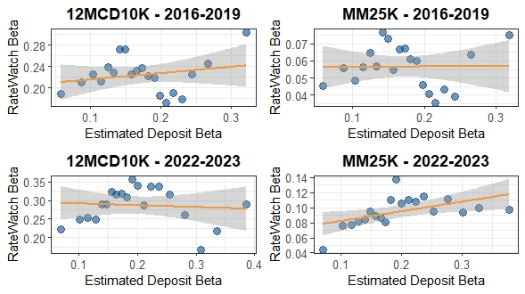

## [← Index](index.html) · [1. Editor and referee comments](response-plan.html)

# RateWatch Validation of Branch-Level Deposit Betas

This page documents a robustness check that compares our **imputed branch-level deposit betas** to **realized betas constructed from RateWatch branch-level deposit rates**, addressing **referee comment 6** on the use of RateWatch data.

*Source: `code/analysis/ratewatch_vs_estimated_beta_v2.0.r`*

---

## 1. Design

- **Products.** We focus on two widely observed retail products in RateWatch: 12‑month CDs with a \$10,000 minimum (`12MCD10K`) and money market accounts with a \$25,000 minimum (`MM25K`).
- **Cycles.** For each product, we construct RateWatch betas over two tightening cycles: **2016–2019** and **2022–2023**, normalizing by the cumulative change in the federal funds rate over the period.
- **Units.** RateWatch betas are computed at the **branch–product** level and then merged to our branch sample using FDIC identifiers. We then average our **estimated branch deposit betas** over the same years to obtain a comparable branch‑level measure.

---

## 2. RateWatch Betas versus Estimated Deposit Betas

The figure below plots binned scatter diagrams of **RateWatch deposit betas** (vertical axis) against our **estimated deposit betas** (horizontal axis), separately by product and cycle. Each point is a bin of branches, and the orange line shows the linear fit within each panel.

Overall, the scatterplots indicate that where RateWatch data are available, branches with higher imputed deposit betas also tend to have higher realized betas from observed pricing, providing validation that the **projected branch-level betas align with actual rate-setting behavior** in overlapping samples.

