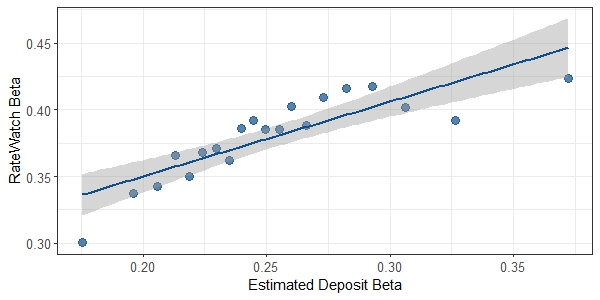
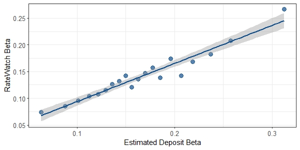
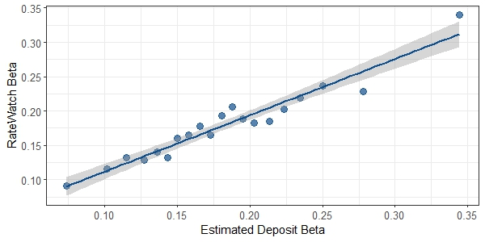

## [← Index](index.html) · [1. Editor and referee comments](response-plan.html)

# RateWatch Validation of Branch-Level Deposit Betas

This page documents a robustness check that compares our **imputed branch-level deposit betas** to **realized betas constructed from RateWatch branch-level deposit rates**, addressing **referee comment 6** on the use of RateWatch data.

*Source: `code/analysis/ratewatch_vs_estimated_beta_v2.0.r`*

---

## 1. Design

- **Products and aggregation.** We use RateWatch rates for savings (`SAV2.5K`), 12‑month CDs (`12MCD10K`), and money market accounts (`MM25K`). Rather than product-level betas, we construct a **deposit-weighted effective rate** for each bank–branch–year by weighting these product rates by the bank’s deposit composition (time deposits, money market balances, and savings). The resulting RateWatch beta measures how much each branch’s effective deposit cost changes per percentage-point change in the federal funds rate.
- **Cycles.** We construct RateWatch betas over three tightening cycles: **2004–2006**, **2016–2019**, and **2022–2023**. Each beta is normalized by the cumulative change in the federal funds rate over the period.
- **Units.** RateWatch betas are computed at the **branch** level. We merge to our branch sample and average our **estimated branch deposit betas** over the same years to obtain a comparable branch‑level measure.
- **Bank size.** Branches are split into large vs. small banks based on a CPI-adjusted asset cutoff of \$100M (in 2024 dollars). Bins and linear fits are computed separately by size, and regressions are run both overall and by bank size.
- **Sample selection.** To restrict the sample to banks that meaningfully adjust deposit rates during each cycle, we exclude banks whose 12‑month CD rate (12MCD10K) increased by less than 10 basis points from period start to period end. Banks that raise CD rates by at least 10 basis points are retained; those with smaller or negative increases are dropped for the corresponding cycle.

---

## 2. RateWatch Betas versus Estimated Deposit Betas

The figures below plot binned scatter diagrams of **RateWatch deposit betas** (vertical axis) against our **estimated deposit betas** (horizontal axis), separately for each tightening cycle. Each point is a bin of branches; the line shows the linear fit. The sample includes only banks whose 12‑month CD rate increased by at least 10 basis points during the cycle.

### 2004 - 2006

### 2016 - 2019

### 2022 - 2023

