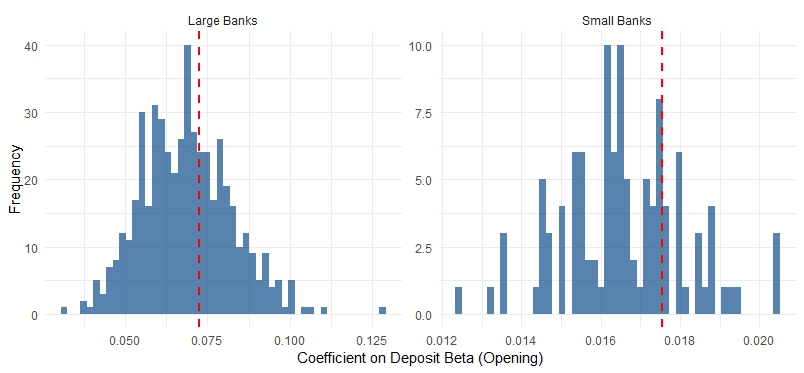

## [← Index](index.html) · [3. Key closure results](key-closure-results.html)

# Two-Stage Bootstrap Standard Errors for Branch Closure Regressions

This document collects results from the two-stage bootstrap that accounts for **generated regressor uncertainty** in the branch closure regressions. The first stage re-estimates bank-level deposit beta regressions; the second stage re-estimates branch-level closure regressions. Standard errors from clustered OLS underestimate uncertainty because deposit beta is predicted from the first stage. The bootstrap provides corrected inference.

*Source: `code/analysis/closure_se_bootstrap_02172026.R`*

---

## Methodology

1. **Stage 1 (bootstrap):** Resample banks with replacement; re-estimate bank-level deposit expense sensitivity regressions for each rate cycle (2004–2006, 2016–2019, 2022–2024).
2. **Stage 2 (bootstrap):** Predict branch-level deposit betas from Stage 1; run closure regression with controls and fixed effects.
3. **Repeat** 500 times; compute bootstrap SE and 95% CI from the distribution of deposit beta coefficients.

---

## Results


### Comparison Table

```
   Bank_Size Coefficient SE_Clustered SE_Bootstrap   CI_Lower   CI_Upper N_Bootstrap
      <char>       <num>        <num>        <num>      <num>      <num>       <int>
1:     Large  0.13232379  0.018977607  0.016913751 0.10297358 0.17048591         500
2:     Small  0.08090054  0.009223955  0.008351284 0.06240404 0.09607212         500
```

---

## Bootstrap Distribution


Bootstrap distributions of the deposit beta coefficient for large and small banks. Red dashed line: original point estimate. Histograms show the distribution across 500 two-stage bootstrap replications.

---

## Opening Bootstrap (placeholder)

Same two-stage bootstrap procedure applied to **branch opening** regressions. Placeholder for results.

*Source: `code/analysis/opening_se_bootstrap_XXXXXX.R` (to be created)*

### Comparison Table

```
   Bank_Size Coefficient SE_Clustered SE_Bootstrap   CI_Lower   CI_Upper N_Bootstrap
      <char>       <num>        <num>        <num>      <num>      <num>       <int>
1:     Large  0.07238350 0.0125368089  0.013544923 0.04480232 0.09609134         501
2:     Small  0.01753918 0.0007871459  0.001520083 0.01357009 0.01968077         111
```

### Bootstrap Distribution



